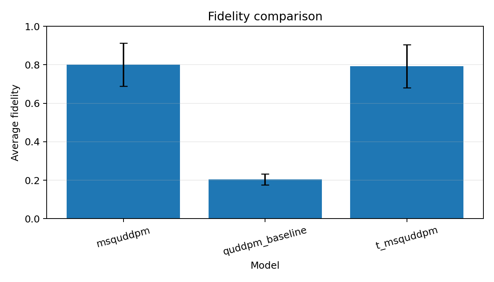
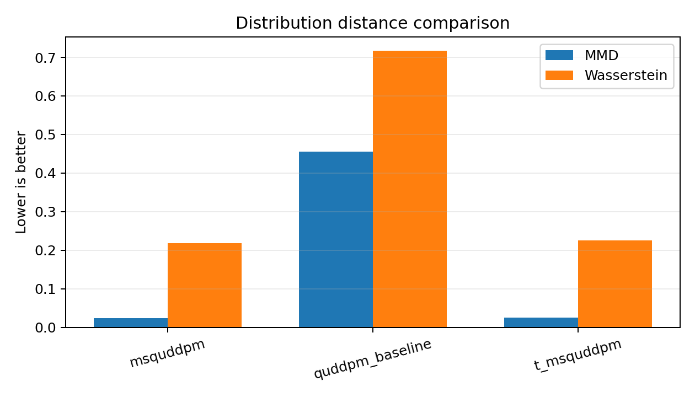
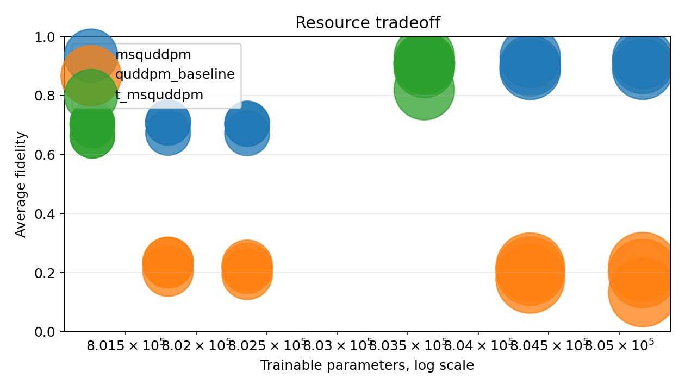
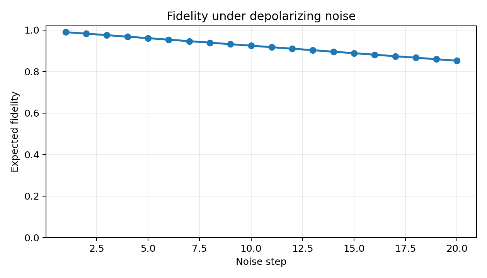
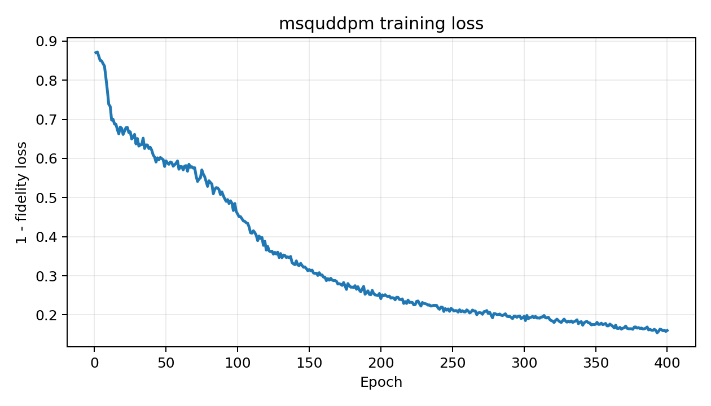
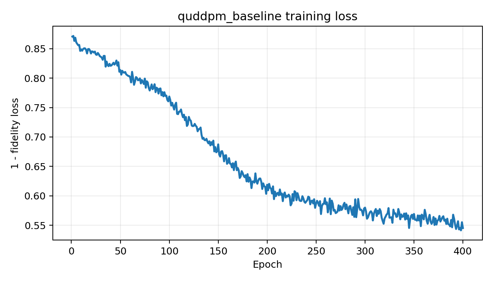
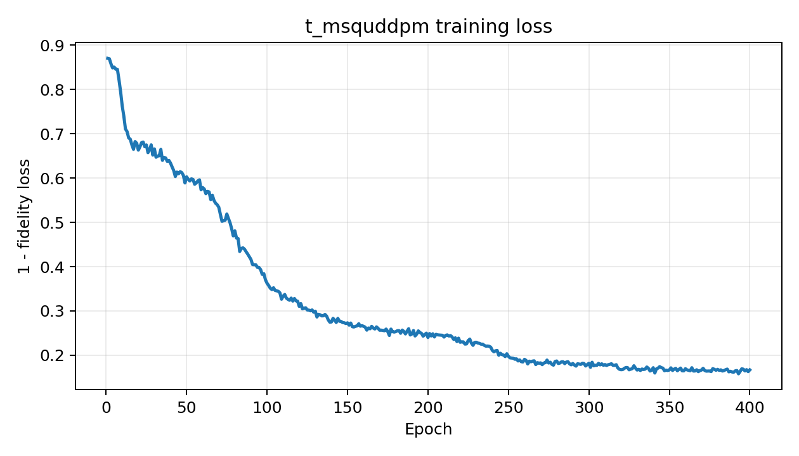

# QuDDPM-lite PyTorch 실험 노트

양자 diffusion 모델이 실제로 어떤 모양으로 움직이는지 궁금해서, Qiskit이나 PennyLane 없이 PyTorch만으로 작게 돌려본 실험입니다. 전체 QuDDPM을 그대로 재현하려는 코드는 아니고, 6-qubit 상태에서 noise를 넣고 denoiser가 clean state를 얼마나 되찾는지 확인하는 가벼운 sandbox에 가깝습니다.

CUDA가 있으면 GPU를 쓰고, 없으면 CPU로 돌아갑니다.

## 해본 것

- 6-qubit pure state ensemble 생성
- density matrix 기반 depolarizing forward process 구현
- random-unitary scrambling을 쓰는 baseline 추가
- MSQuDDPM-lite, T-MSQuDDPM-lite 형태의 denoiser 비교
- `T=10/20`, `depth=2/4`, seed 3개 조합으로 반복 실행
- fidelity, MMD, Wasserstein distance와 간단한 resource metric 기록
- CSV 결과와 PNG figure 자동 저장

사용한 depolarizing channel은 아래처럼 단순하게 두었습니다.

```text
rho_noisy = (1 - beta) * rho + beta * I / dim
```

## 비교한 모델

| 모델 | 이 실험에서의 역할 |
|---|---|
| `msquddpm` | depolarizing noise를 되돌리는 기본 denoiser |
| `quddpm_baseline` | random single-qubit rotation과 entangling layer로 만든 baseline |
| `t_msquddpm` | time embedding과 temporal parameter sharing을 넣은 변형 |

## 저장해둔 실행 결과

`results_twohour/`에는 조금 길게 돌린 결과를 남겨두었습니다.

```bash
python main.py --preset twohour --results-dir results_twohour
python verify_results.py --results-dir results_twohour
```

그 실행에서 확인한 조건은 아래와 같습니다.

| 항목 | 값 |
|---|---:|
| qubits | 6 |
| input mode | density matrix |
| Hilbert dimension | 64 |
| density matrix | 64 x 64 complex64 |
| dataset size | 512 |
| epochs | 400 |
| batch size | 128 |
| seeds | 0, 1, 2 |
| noise steps | 10, 20 |
| PQC depth | 2, 4 |
| device | cuda |
| recorded train runtime | 48.87 min |
| peak recorded GPU memory | 52.65 MB |

전체 조합 평균은 다음처럼 나왔습니다.

| 모델 | Fidelity ↑ | MMD ↓ | Wasserstein ↓ | 평균 runtime / row |
|---|---:|---:|---:|---:|
| `msquddpm` | 0.8012 | 0.0245 | 0.2182 | 74.42 s |
| `quddpm_baseline` | 0.2051 | 0.4552 | 0.7168 | 95.77 s |
| `t_msquddpm` | 0.7927 | 0.0257 | 0.2258 | 74.14 s |

높은 fidelity를 보인 설정은 대체로 depth 4 쪽이었습니다.

| 모델 | T | Depth | Fidelity mean |
|---|---:|---:|---:|
| `msquddpm` | 20 | 4 | 0.9078 |
| `msquddpm` | 10 | 4 | 0.9066 |
| `t_msquddpm` | 10 | 4 | 0.9037 |
| `t_msquddpm` | 20 | 4 | 0.8880 |

가볍게 해석하면, depolarizing noise를 넣은 경우에는 `msquddpm` 계열이 꽤 잘 복원했고, time-sharing을 넣은 `t_msquddpm`도 큰 손해 없이 비슷하게 따라왔습니다. 반대로 random-unitary baseline은 forward process 자체가 상태를 더 강하게 섞어서 fidelity가 낮게 나왔습니다.

## Figure

모델별 fidelity 평균을 비교한 그림입니다. depolarizing noise를 되돌리는 `msquddpm` 계열과 random-unitary baseline의 차이가 가장 먼저 보입니다.



MMD와 Wasserstein distance를 같이 본 그림입니다. fidelity만 볼 때와 비슷하게, baseline 쪽 분포 차이가 더 크게 잡힙니다.



성능과 자원 사용량을 같이 보려고 만든 tradeoff 그림입니다. 같은 qubit 수에서도 depth와 모델 구조에 따라 runtime과 gate count가 어떻게 달라지는지 확인할 수 있습니다.



depolarizing noise 강도에 따라 기대 fidelity가 어떻게 내려가는지 확인한 곡선입니다. denoising 결과를 해석할 때 noise schedule의 기본 모양을 보는 용도입니다.



`msquddpm` 학습 중 loss가 어떻게 움직였는지 저장한 곡선입니다. seed와 ablation 조합별로 수렴 양상을 빠르게 확인하는 용도입니다.



random-unitary baseline의 loss curve입니다. forward process가 더 강하게 상태를 섞기 때문에 다른 denoiser와 다른 학습 난이도를 보입니다.



time-sharing을 넣은 `t_msquddpm`의 loss curve입니다. parameter sharing을 넣어도 기본 `msquddpm`과 비슷한 방향으로 학습되는지 확인하려고 남겼습니다.



## 코드 구조

```text
.
├── main.py                  # 실행용 얇은 wrapper
├── verify_results.py        # 결과 검사용 wrapper
├── src/
│   └── quddpm_lite/
│       ├── cli.py
│       ├── config.py
│       ├── datasets.py
│       ├── experiments.py
│       ├── metrics.py
│       ├── models.py
│       ├── noise.py
│       ├── random_unitary.py
│       ├── train.py
│       ├── utils.py
│       ├── verify.py
│       └── visualize.py
├── results_twohour/
├── requirements.txt
└── twohour_conditions.md
```

파일별 역할은 대략 이렇습니다.

| 파일 | 역할 |
|---|---|
| `src/quddpm_lite/config.py` | `smoke`, `mini`, `twohour`, `research`, `full` preset |
| `src/quddpm_lite/datasets.py` | product, entangled, Bell-pair state ensemble 생성 |
| `src/quddpm_lite/noise.py` | depolarizing channel과 8-qubit statevector proxy |
| `src/quddpm_lite/random_unitary.py` | random-unitary forward process |
| `src/quddpm_lite/models.py` | denoiser 모델 정의 |
| `src/quddpm_lite/train.py` | 학습과 평가 루프 |
| `src/quddpm_lite/experiments.py` | seed/model/ablation grid 실행과 결과 저장 |
| `src/quddpm_lite/visualize.py` | CSV 결과를 PNG figure로 변환 |
| `src/quddpm_lite/verify.py` | 저장된 결과 파일과 metric row 확인 |

## 실행

환경은 보통 아래처럼 만들면 됩니다.

```bash
python3 -m venv .venv --system-site-packages
. .venv/bin/activate
python -m pip install -r requirements.txt
```

빠르게 코드가 도는지만 확인하려면 smoke preset을 쓰면 됩니다.

```bash
python main.py --preset smoke --results-dir results
python verify_results.py --results-dir results
```

조금 더 길게 남겨둔 결과를 다시 만들려면:

```bash
python main.py --preset twohour --results-dir results_twohour
python verify_results.py --results-dir results_twohour
```

## 산출물

실행하면 결과 폴더에 아래 파일들이 생깁니다.

- `metrics.csv`
- `summary_table.csv`
- `seed_summary.csv`
- `loss_history.csv`
- `noise_curve.csv`
- `fidelity_comparison.png`
- `mmd_wasserstein_comparison.png`
- `resource_tradeoff.png`
- `fidelity_vs_noise.png`
- `loss_curve_msquddpm.png`
- `loss_curve_baseline.png`
- `loss_curve_t_msquddpm.png`

기존에 길게 돌려둔 결과는 `results_twohour/`에 있고, 빠른 smoke 실행은 기본적으로 `.gitignore`에 들어간 `results/`에 생성됩니다.
