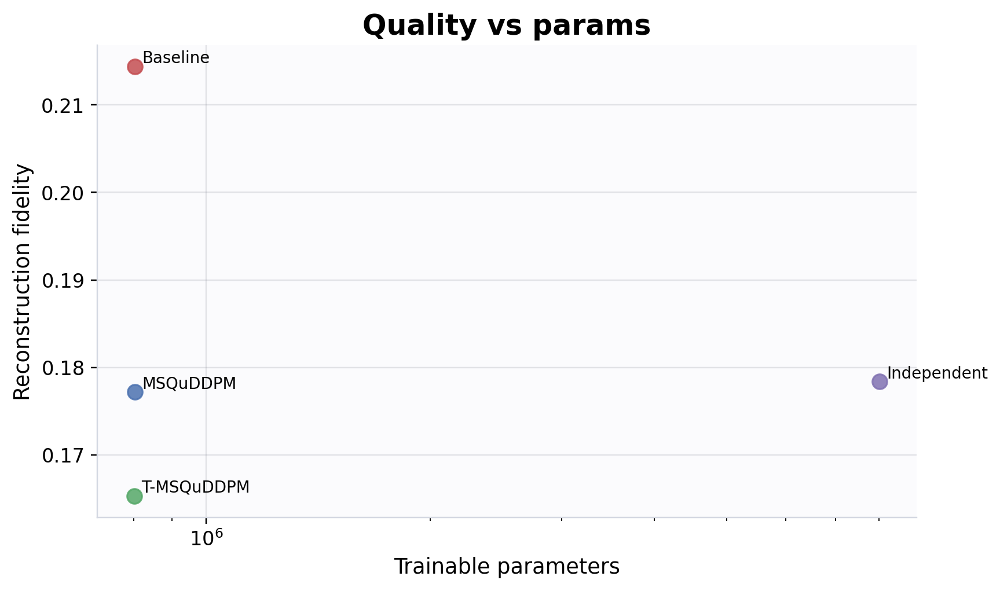

# QuDDPM Lightweight Benchmark Sandbox

> **QuDDPM/MSQuDDPM 아이디어를 바탕으로 한 본선 대비용 lightweight sandbox**  
> 이 저장소는 논문 완전 재현이나 실제 양자 하드웨어 성능 검증을 목표로 하지 않는다. 목적은 Quantum DDPM 계열 문제를 대비하기 위해 forward diffusion, denoising, prior-based generation evaluation, metric calculation, resource comparison을 작은 규모에서 빠르게 실험하고, 각 방법의 장점과 한계를 구조적으로 비교하는 것이다.

---

## Abstract

본 프로젝트는 Quantum Denoising Diffusion Probabilistic Model, QuDDPM 계열의 핵심 구성요소를 PyTorch 기반으로 단순화하여 구현한 연구형 사전 실험 플랫폼이다. 공개된 QuDDPM 계열 연구는 quantum state ensemble을 생성 대상으로 보고, forward process에서 target quantum data를 noise 또는 scrambled distribution으로 이동시키며, reverse process에서 parameterized model을 통해 target distribution을 복원하거나 생성하는 구조를 제안한다. 본 프로젝트는 이 아이디어를 본선 해커톤 대비용으로 축소하여, 작은 qubit 수에서 random-unitary forward, depolarizing-channel forward, denoising model, one-step generator comparator, metric evaluation, resource accounting을 비교한다.

핵심 목표는 단일 모델의 우수성을 주장하는 것이 아니라, 다음 질문을 실험적으로 다루는 것이다.

1. reconstruction 성능과 prior-based generation 성능은 어떻게 다르게 나타나는가?
2. random-unitary forward와 depolarizing-channel forward를 비교할 때, noise 강도 차이를 어떻게 통제해야 하는가?
3. temporal parameter sharing은 step-wise independent denoiser 대비 parameter growth를 얼마나 줄이는가?
4. one-step generator comparator는 diffusion-style model과 어떤 품질-자원 trade-off를 보이는가?
5. resource metric을 보고할 때 explicit unitary depth, channel application count, total reverse cost를 어떻게 분리해야 하는가?

대표 benchmark에서는 `quddpm_baseline`, `msquddpm`, `t_msquddpm`, `cnr`, `independent_step_quddpm`을 비교했다. 결과적으로 `quddpm_baseline`은 reconstruction fidelity에서 가장 높은 값을 보였지만, generation Wasserstein과 total estimated depth에서는 불리했다. `msquddpm`와 `t_msquddpm`는 baseline보다 낮은 generation Wasserstein을 보였고, independent-step baseline 대비 약 90% 수준의 parameter reduction을 보였다. `cnr`는 generation-only one-step comparator로서 가장 낮은 generation Wasserstein을 기록했다. 이러한 결과는 “특정 모델이 항상 우수하다”는 결론보다, **평가 목적에 따라 reconstruction, generation, parameter efficiency, resource cost를 분리해 해석해야 한다**는 점을 보여준다.

---

## Project Scope

이 프로젝트는 다음을 목표로 한다.

- Quantum DDPM 계열 문제를 대비하기 위한 lightweight benchmark 구성
- quantum state ensemble 생성과 forward corruption 과정 실험
- denoising benchmark와 prior-based generation benchmark의 분리
- fidelity, MMD, Wasserstein distance를 활용한 ensemble-level evaluation
- random-unitary forward와 depolarizing-channel forward의 비교 공정성 점검
- parameter sharing과 independent-step denoiser의 parameter-efficiency 비교
- one-step generator comparator의 generation quality 및 resource profile 확인
- 작은 규모의 ancilla post-selection concept demo 제공

이 프로젝트는 다음을 목표로 하지 않는다.

- QuDDPM, MSQuDDPM, TQuDDPM 논문 전체 재현
- 실제 양자 하드웨어 실험 결과 주장
- hardware-transpiled circuit resource count 제공
- 특정 본선 문제의 정답 구현
- CNR을 QuDDPM의 대체 모델로 주장
- ancilla toy module을 full measurement-based QuDDPM 구현으로 주장

따라서 본 저장소는 **논문 재현 코드가 아니라, 본선 대비용 연구형 sandbox**로 해석해야 한다.

---

## Background and Motivation

### DDPM and Generative Modeling

Denoising Diffusion Probabilistic Model, DDPM은 데이터를 점진적으로 noise화하는 forward process와, 그 역과정을 학습하는 reverse process를 통해 복잡한 데이터 분포를 생성하는 모델이다. 고전 생성모델에서 diffusion model은 안정적인 학습과 고품질 생성 능력을 보여주었고, 이 아이디어는 quantum data distribution에도 확장될 수 있다.

### QuDDPM

QuDDPM 계열 접근은 quantum state ensemble을 생성 대상으로 삼는다. 일반적인 구조는 다음과 같다.

```text
target quantum state ensemble
→ forward scrambling 또는 noise process
→ noisy / scrambled ensemble
→ trainable reverse denoising process
→ generated 또는 reconstructed ensemble
```

QuDDPM류 방법의 핵심은 단일 quantum state를 맞추는 것이 아니라, state ensemble의 분포를 학습한다는 점이다. 따라서 단일 fidelity만으로는 충분하지 않으며, MMD나 Wasserstein distance와 같은 ensemble-level metric이 필요하다.

### MSQuDDPM-style Idea

Random-unitary scrambling은 표현력 측면에서는 유용하지만, explicit circuit depth와 two-qubit gate cost를 증가시킬 수 있다. MSQuDDPM 계열 아이디어는 forward process를 depolarizing noise channel로 단순화하여, random-unitary gate sequence를 직접 쌓는 부담을 줄이는 방향을 제시한다. 본 프로젝트에서는 이를 `msquddpm`와 `t_msquddpm`의 depolarizing forward로 단순화해 실험한다.

### TQuDDPM-style Idea

Diffusion step마다 독립적인 denoiser를 두면 parameter count와 optimizer burden이 증가한다. TQuDDPM 계열 아이디어는 temporal encoding 또는 parameter sharing을 통해 step-wise parameter growth를 줄이는 방향을 제시한다. 본 프로젝트에서는 `independent_step_quddpm`을 naive upper-cost baseline으로 두고, `t_msquddpm`와 비교하여 temporal sharing의 parameter-efficiency를 관찰한다.

### Classical Noise Reuploading Comparator

`cnr`는 QuDDPM의 대체 모델이 아니라, one-step generator comparator이다. Target-conditioned noisy input을 사용하지 않고 latent classical noise를 입력으로 받아 generated ensemble을 만든다. 이 비교군은 diffusion-style model과 one-step generator가 각각 어떤 품질-자원 trade-off를 갖는지 보기 위한 기준선이다.

---

## Research Questions

본 프로젝트의 연구 질문은 다음과 같다.

### RQ1. How do reconstruction and generation differ?

Denoising benchmark는 target state에서 noisy input을 만든 뒤 clean target을 복원한다. 반면 generation benchmark는 target input 없이 prior에서 시작하여 generated ensemble을 만들고, 이를 target test ensemble과 비교한다. 본 프로젝트는 두 평가를 의도적으로 분리한다.

### RQ2. Are random-unitary and depolarizing forwards compared fairly?

두 forward process는 물리적으로 동일하지 않으며, corruption strength도 자동으로 같아지지 않는다. 본 프로젝트는 final target-noisy fidelity를 operational 기준으로 삼아 forward severity를 기록하고, `match_corruption` 옵션으로 비교 조건을 맞추는 calibration을 제공한다.

### RQ3. Does temporal parameter sharing reduce parameter growth?

`independent_step_quddpm`은 diffusion step마다 별도 denoiser를 갖는 naive baseline이다. `t_msquddpm`는 shared denoiser와 time conditioning을 사용한다. 두 모델의 parameter count와 quality metric을 비교하여 parameter-efficiency를 확인한다.

### RQ4. Where does the one-step generator comparator sit?

`cnr`는 generation-only one-step comparator이다. 이 모델은 reconstruction metric이 아니라 generation MMD, generation Wasserstein, nearest fidelity로 평가한다. 이를 통해 diffusion-style model과 one-step generator의 trade-off를 비교한다.

### RQ5. How should resource metrics be separated and reported?

Depolarizing channel의 physical cost를 explicit random-unitary depth와 동일시하면 안 된다. 따라서 본 프로젝트는 explicit unitary depth, total reverse depth, channel application count, trainable parameter count, runtime을 분리해 기록한다.

---

## Methodology

### Overall Pipeline

```text
quantum state ensemble 생성
→ forward process 적용
→ denoising model 또는 one-step generator 학습
→ reconstruction / generation metric 분리 평가
→ resource metric 기록
→ fairness check 및 parameter-efficiency 분석
→ report 생성
```

### Data Representation

프로젝트는 작은 qubit 수의 statevector 및 density matrix를 사용한다. 주요 실험에서는 density matrix 기반 forward process와 pure-state target ensemble을 함께 다룬다. 지원되는 prior mode는 다음과 같다.

| prior mode | 설명 |
|---|---|
| `random_pure` | random complex Gaussian state를 normalize하여 prior state 생성 |
| `maximally_mixed_jitter` | maximally mixed state와 random pure component를 소량 혼합 |
| `depolarized_random` | random pure state를 강하게 depolarize하여 prior로 사용 |

### Forward process

본 프로젝트는 두 가지 forward corruption을 지원한다.

| forward type | 사용 모델 | 의미 |
|---|---|---|
| `random_unitary` | `quddpm_baseline` | random-unitary scrambling baseline |
| `depolarizing` | `msquddpm`, `t_msquddpm`, `independent_step_quddpm` | noise-channel forward surrogate |
| `cnr_none` | `cnr` | one-step generator comparator이므로 forward corruption 없음 |

Depolarizing schedule은 두 가지를 지원한다.

Single-beta mode:

```text
rho_t = (1 - beta_t) rho_0 + beta_t I / d
```

Cumulative mode:

```text
alpha_bar_t = Π_s≤t (1 - beta_s)
rho_t = alpha_bar_t rho_0 + (1 - alpha_bar_t) I / d
```

### Match corruption

`--match-corruption` 옵션은 random-unitary baseline의 final target-noisy fidelity를 기준으로 depolarizing schedule을 보정한다. 이는 두 forward process가 물리적으로 같다는 의미가 아니라, finite benchmark에서 noise severity를 operational하게 맞추기 위한 calibration이다.

기록되는 주요 컬럼은 다음과 같다.

- `match_corruption_enabled`
- `target_corruption_fidelity`
- `actual_forward_fidelity_mean`
- `corruption_match_error_abs`
- `calibrated_beta_end`
- `calibrated_alpha_bar_final`
- `corruption_match_method`

### Models

| 모델 | 역할 | 핵심 해석 |
|---|---|---|
| `quddpm_baseline` | random-unitary baseline denoiser | explicit unitary scrambling baseline |
| `msquddpm` | depolarizing forward denoiser | noise-channel forward surrogate |
| `t_msquddpm` | temporal-sharing denoiser | parameter sharing 기반 변형 |
| `cnr` | one-step generator comparator | latent noise에서 직접 generated ensemble 생성 |
| `independent_step_quddpm` | step-wise independent baseline | parameter growth reference |
| `ancilla_toy` | post-selection concept demo | data+ancilla PQC와 measurement idea 확인 |

### Metrics

Reconstruction metric:

- `reconstruction_fidelity`
- `reconstruction_pure_state_fidelity`
- `reconstruction_mmd`
- `reconstruction_wasserstein`

Generation metric:

- `generation_mmd`
- `generation_wasserstein`
- `generation_nearest_fidelity_mean`
- `generation_prior_mode`
- `generation_sampling_mode`

Resource metric:

- `trainable_parameters`
- `denoiser_depth_per_step`
- `total_reverse_depth`
- `forward_unitary_depth`
- `channel_application_count`
- `total_estimated_depth`
- `total_estimated_two_qubit_gate_count`
- `runtime_sec`

Post-selection metric:

- `success_probability_mean`
- `success_probability_std`
- `post_selection_required`
- `ancilla_qubits`

---

## Research Environment

README 대표 benchmark와 figure는 아래 환경에서 생성했다.

| Item | Value |
|---|---|
| OS | Linux 5.4.0-173-generic x86_64 |
| Python | 3.12.3 |
| PyTorch | 2.8.0a0+5228986c39.nv25.05 |
| CUDA | 12.9 |
| GPU | NVIDIA A100-SXM4-80GB |
| GPU count | 1 |

이 저장소는 CPU에서도 실행되지만, `twohour_readme` benchmark와 README figure는 위 GPU 환경에서 생성했다.

---

## Representative Benchmark

README용 대표 결과는 `twohour_readme` preset으로 생성했다.

```bash
python main.py --preset twohour_readme --results-dir results_readme_twohour
```

실험 조건은 다음과 같다.

| 항목 | 값 |
|---|---|
| qubits | 6 |
| dataset size | 512 |
| noise steps | 10 |
| depth | 2 |
| hidden dim | 96 |
| epochs | 400 |
| seeds | 3 |
| models | `quddpm_baseline`, `msquddpm`, `t_msquddpm`, `cnr`, `independent_step_quddpm` |
| depolarizing mode | `single_beta` |
| prior mode | `depolarized_random` |
| generation sampling | `one_step` |
| match corruption | enabled |

### Result Summary

| 모델 | Reconstruction Fidelity ↑ | Generation MMD ↓ | Generation Wasserstein ↓ | Nearest Fidelity ↑ | Params ↓ | Total Depth ↓ | Runtime sec ↓ |
|---|---:|---:|---:|---:|---:|---:|---:|
| `cnr` | N/A | 0.0664 | 0.6421 | 0.4918 | 12,912 | 34 | 51.90 |
| `independent_step_quddpm` | 0.1784 | 0.7695 | 0.8213 | 0.9041 | 8,012,960 | 340 | 707.85 |
| `msquddpm` | 0.1772 | 0.7416 | 0.8145 | 0.8799 | 801,800 | 340 | 51.33 |
| `quddpm_baseline` | 0.2144 | 0.8850 | 0.8649 | 0.6631 | 801,800 | 680 | 66.06 |
| `t_msquddpm` | 0.1653 | 0.5769 | 0.8096 | 0.6452 | 801,264 | 340 | 51.58 |

해석은 다음과 같다.

1. `quddpm_baseline`은 reconstruction fidelity에서 가장 높은 값을 보였지만, generation Wasserstein과 total estimated depth에서는 불리했다.
2. `msquddpm`와 `t_msquddpm`는 baseline보다 낮은 generation Wasserstein을 보였으며, total estimated depth도 baseline의 절반 수준이다.
3. `t_msquddpm`는 `msquddpm`보다 reconstruction fidelity는 낮지만, generation MMD와 Wasserstein에서는 더 좋은 값을 보였다.
4. `independent_step_quddpm`는 parameter count와 runtime이 매우 크며, 이 모델은 품질 우월성을 보이기보다 step-wise independent parameterization의 비용을 보여주는 reference이다.
5. `cnr`는 generation-only comparator로서 가장 낮은 generation Wasserstein을 보였지만, QuDDPM 대체 모델이 아니라 one-step generator baseline으로 해석해야 한다.

### Parameter efficiency

`independent_step_quddpm` 대비 parameter reduction은 다음과 같다.

| 모델 | Parameter Ratio vs Independent | Parameter Reduction |
|---|---:|---:|
| `cnr` | 0.0016 | 99.84% |
| `msquddpm` | 0.1001 | 89.99% |
| `quddpm_baseline` | 0.1001 | 89.99% |
| `t_msquddpm` | 0.1000 | 90.00% |
| `independent_step_quddpm` | 1.0000 | 0.00% |

이 결과는 temporal/shared denoiser 계열이 step-wise independent denoiser 대비 optimizer burden을 크게 줄일 수 있음을 보여준다. 다만 이 결과는 lightweight benchmark 조건에서의 비교이며, 논문 전체 재현 결과로 해석하면 안 된다.

---

## Figures

대표 결과 폴더는 `results_readme_twohour/`이다.

- Generation quality: `results_readme_twohour/generation_quality_comparison.png`
- Total resource trade-off: `results_readme_twohour/total_resource_tradeoff.png`
- Parameter efficiency: `results_readme_twohour/parameter_efficiency.png`
- Quality vs parameters: `results_readme_twohour/quality_vs_params.png`
- Parameter reduction vs quality: `results_readme_twohour/parameter_reduction_vs_quality.png`
- Report: `results_readme_twohour/report.md`

### Generation quality


이 그림은 generation Wasserstein 기준 비교다. `cnr`가 가장 낮은 값을 보이며 generation-only comparator로서는 가장 강하게 나타난다. `msquddpm`와 `t_msquddpm`는 `quddpm_baseline`보다 더 낮은 generation Wasserstein을 보여, generation benchmark에서는 shared depolarizing 계열이 baseline보다 유리한 위치를 갖는다.

### Total resource trade-off


이 그림은 total estimated depth와 generation Wasserstein을 함께 본다. `quddpm_baseline`은 depth가 가장 크고 generation metric도 불리하다. `msquddpm`와 `t_msquddpm`는 더 낮은 depth 구간에서 더 나은 generation metric을 보여, 비용-품질 trade-off가 더 좋은 쪽에 위치한다. `cnr`는 one-step comparator이므로 depth가 매우 낮은 별도 위치를 형성한다.

### Parameter efficiency


이 그림은 `independent_step_quddpm` 대비 shared 계열의 parameter 절감을 직관적으로 보여준다. `independent_step_quddpm`는 약 8.0M parameters를 가지는 반면, `msquddpm`와 `t_msquddpm`는 약 0.8M 수준이다. 따라서 temporal/shared denoiser 계열이 step-wise independent parameterization보다 훨씬 작은 optimizer burden으로 동작함을 확인할 수 있다.

### Quality vs parameters



이 그림은 reconstruction fidelity와 parameter 수를 함께 본다. `quddpm_baseline`은 reconstruction fidelity가 가장 높지만, 그 자체가 generation quality 우위를 보장하지는 않는다. `independent_step_quddpm`는 훨씬 많은 parameters를 사용하지만 reconstruction fidelity가 baseline을 크게 넘지 못한다는 점에서, parameter 증가가 곧바로 품질 우월성으로 이어지지 않음을 보여준다.

### Parameter reduction vs quality


이 그림은 independent baseline 대비 parameter reduction과 quality 변화를 함께 보여준다. `msquddpm`와 `t_msquddpm`는 약 90% parameter reduction을 달성하면서 품질 저하를 크게 늘리지 않았다. 특히 `t_msquddpm`는 reconstruction fidelity는 다소 낮지만 generation metric에서는 경쟁력 있는 값을 보이며, parameter-efficient shared denoiser의 실용적 의미를 드러낸다.

### Full report

[report.md](results_readme_twohour/report.md)

---

## Reproducibility

### Installation

```bash
pip install -r requirements.txt
```

CUDA가 있으면 GPU를 사용하고, 없으면 CPU에서 실행된다.

### Quick smoke test

```bash
python main.py --preset smoke --results-dir results_smoke
python verify_results.py --results-dir results_smoke
```

### mini benchmark

```bash
python main.py --preset mini --models msquddpm t_msquddpm cnr --results-dir results_mini
python verify_results.py --results-dir results_mini
```

### match corruption smoke

```bash
python main.py --preset smoke --models quddpm_baseline msquddpm --match-corruption --results-dir results_match_smoke
python verify_results.py --results-dir results_match_smoke
```

### parameter efficiency benchmark

```bash
python main.py --preset mini --models independent_step_quddpm t_msquddpm msquddpm --results-dir results_param_eff
python verify_results.py --results-dir results_param_eff
```

### ancilla toy smoke

```bash
python main.py --preset smoke --models ancilla_toy --results-dir results_ancilla_smoke
python verify_results.py --results-dir results_ancilla_smoke
```

### Report generation

```bash
python -m quddpm_lite.report --results-dir results_readme_twohour --out results_readme_twohour/report.md
```

---

## Repository layout

```text
config.py         : preset과 실험 설정
cli.py            : command-line arguments
main.py           : benchmark entry point
datasets.py       : quantum state ensemble 생성
noise.py          : depolarizing schedule, corruption calibration
random_unitary.py : random-unitary forward process
models.py         : denoiser, CNR, independent-step, ancilla toy models
train.py          : reconstruction / generation training and evaluation
metrics.py        : fidelity, MMD, Wasserstein, resource metrics
experiments.py    : benchmark 실행과 summary 생성
visualize.py      : 결과 plot 생성
report.py         : markdown report 생성
verify.py         : 결과 검증
```

---

## Discussion

본 프로젝트의 핵심은 단순 성능 수치가 아니라, 비교 설계의 타당성이다. QuDDPM 계열 모델을 비교할 때 reconstruction fidelity만 보면 baseline이 유리해 보일 수 있다. 그러나 prior-based generation metric, total resource metric, parameter count, corruption severity를 함께 보면 다른 결론이 나온다. 본 저장소는 이러한 다중 관점 평가를 작은 규모에서 실험하기 위해 설계되었다.

특히 `match_corruption`은 중요한 기능이다. Random-unitary forward와 depolarizing forward는 서로 다른 물리적 process이므로, final target-noisy fidelity를 기준으로 operational severity를 맞추는 것은 완벽한 물리적 동일성을 의미하지 않는다. 그러나 baseline이 noise 강도 차이 때문에 과도하게 불리해지는 것을 막고, finite benchmark에서 비교 공정성을 높이는 데 유용하다.

또한 `independent_step_quddpm`은 성능을 높이기 위한 모델이라기보다, step-wise independent parameterization이 얼마나 비싼지 보여주는 비용 기준점이다. 이 기준점이 있어야 `t_msquddpm`와 같은 temporal/shared denoiser의 parameter-efficiency를 해석할 수 있다.

`cnr`는 가장 낮은 generation Wasserstein을 보였지만, 이를 QuDDPM 대체 모델이라고 해석하면 안 된다. 이 모델은 target-conditioned denoising이나 reverse diffusion chain을 사용하지 않는 one-step generator comparator이다. 따라서 CNR의 의미는 “diffusion-style model이 아니어도 generation-only setting에서는 강한 비교군이 될 수 있다”는 데 있다.

---

## Conclusion

본 프로젝트는 QuDDPM 계열 문제를 본선 대비용으로 축소해 실험할 수 있는 연구형 sandbox로서는 충분히 의미 있는 상태다. 현재 benchmark 기준으로 `quddpm_baseline`은 reconstruction fidelity에서 강점을 보였고, `msquddpm`와 `t_msquddpm`는 generation/resource trade-off에서 더 좋은 위치를 보였으며, `cnr`는 generation-only comparator로서 가장 낮은 generation Wasserstein을 기록했다. 또한 `independent_step_quddpm`는 parameter-efficiency 해석을 위한 비용 기준점 역할을 분명히 수행했다. 따라서 이 저장소는 단일 우승 모델을 주장하기보다, generation, reconstruction, fairness calibration, parameter efficiency, resource cost를 분리해 비교하는 준비된 연구형 benchmark로 제시하는 것이 가장 적절하다.

---

## Limitations and Threats to Validity

본 프로젝트의 결과를 해석할 때 다음 한계를 고려해야 한다.

1. **논문 완전 재현 아님**  
   이 저장소는 QuDDPM, MSQuDDPM, TQuDDPM 논문 전체를 재현하지 않는다. 핵심 아이디어를 본선 대비용으로 단순화한 sandbox이다.

2. **Small-scale benchmark**  
   대표 실험은 6 qubit, 512 samples, 단일 noise-step/depth 조건을 중심으로 한다. 더 큰 qubit 수나 더 복잡한 dataset에서는 결과가 달라질 수 있다.

3. **Heuristic resource metric**  
   total estimated depth와 two-qubit gate count는 hardware-transpiled circuit count가 아니다. 실제 장비 topology, compiler, gate set에 따라 resource cost는 달라질 수 있다.

4. **Depolarizing channel cost 해석 주의**  
   Depolarizing forward는 explicit unitary depth를 줄이는 surrogate로 사용되지만, physical implementation cost가 0이라는 뜻은 아니다. 따라서 `channel_application_count`를 별도 기록한다.

5. **Match corruption은 operational calibration**  
   `match_corruption`은 final target-noisy fidelity를 맞추는 기능이지, random-unitary와 depolarizing process가 물리적으로 동일함을 보장하지 않는다.

6. **Generation sampler의 단순화**  
   현재 prior-based generation은 lightweight surrogate이며, 논문 수준의 exact reverse Markov sampler가 아니다.

7. **CNR의 해석 범위**  
   `cnr`는 QuDDPM 대체 모델이 아니라 one-step generation comparator이다. Reconstruction metric이 없거나 NaN으로 기록될 수 있다.

8. **Ancilla toy의 제한**  
   `ancilla_toy`는 small pure-state setting에서 data+ancilla post-selection 구조를 보여주는 concept demo이다. Full measurement-based QuDDPM reverse process가 아니다.

---

## Future Work

1. Qiskit 또는 PennyLane 기반 transpiled circuit resource count 추가
2. QuDDPM 공식 코드의 circle/cluster benchmark와의 구조적 비교
3. TFIM, GHZ-like, Bell-cluster 등 더 양자적인 dataset 확장
4. Iterative reverse sampling의 안정성 개선
5. Ancilla measurement module의 density-matrix setting 확장
6. Multiple noise-step/depth grid에서 더 큰 ablation 수행
7. Hardware noise model과 coupling map을 반영한 resource-aware benchmark 추가
8. Wasserstein 계산의 scalability 개선
9. 논문 공식 metric과 본 프로젝트 metric의 차이 정량화

---

## References

- Ho et al., Denoising Diffusion Probabilistic Models.
- Zhang et al., Generative quantum machine learning via denoising diffusion probabilistic models.
- Kwun et al., Mixed-State Quantum Denoising Diffusion Probabilistic Model.
- Zhang and Chen, Parameter-efficient Quantum Denoising Diffusion Probabilistic Models with temporal encoding.
- Wang and Wu, Generation via Classical Noise Reuploading.

---

## Application note

이 프로젝트는 본선 세부 문제의 정답을 미리 구현한 것이 아니라, Quantum DDPM 계열 문제에 필요한 forward diffusion, denoising, generation evaluation, metric calculation, resource comparison을 팀 단위로 사전 연습하기 위한 PyTorch 기반 sandbox이다. Reconstruction metric과 generation metric을 분리하고, CNR comparator, independent-step baseline, match-corruption calibration, ancilla toy module을 포함함으로써, 단순 구현보다 공정 비교와 한계 인식을 중시하는 연구형 준비 과정을 지향한다.
