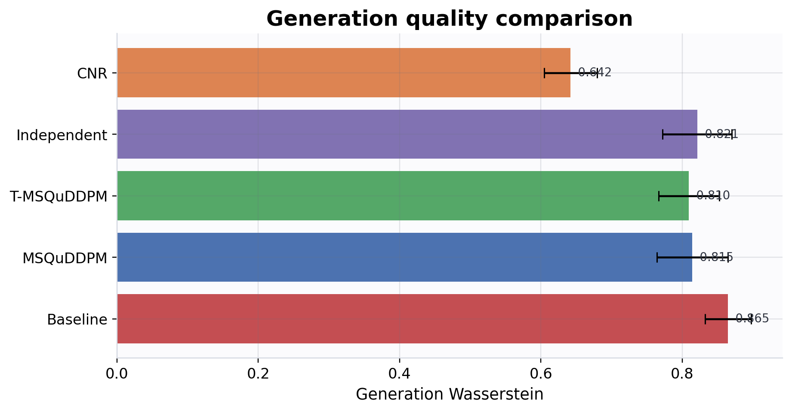
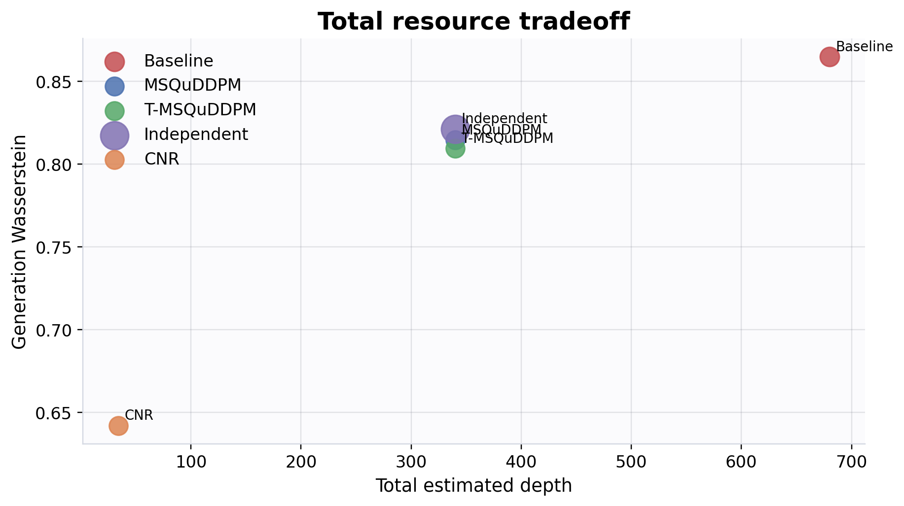
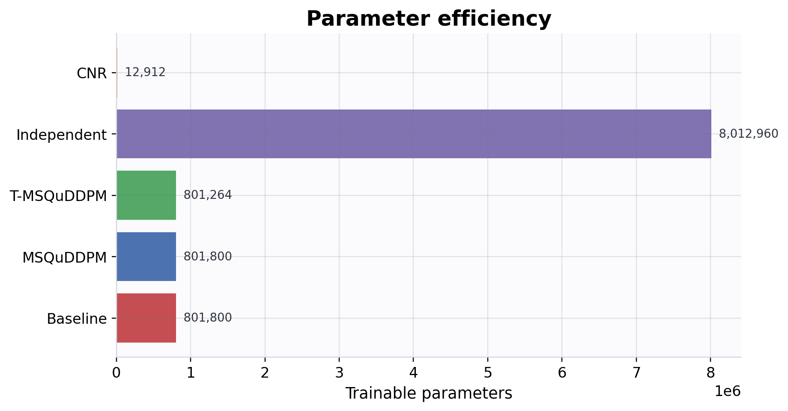
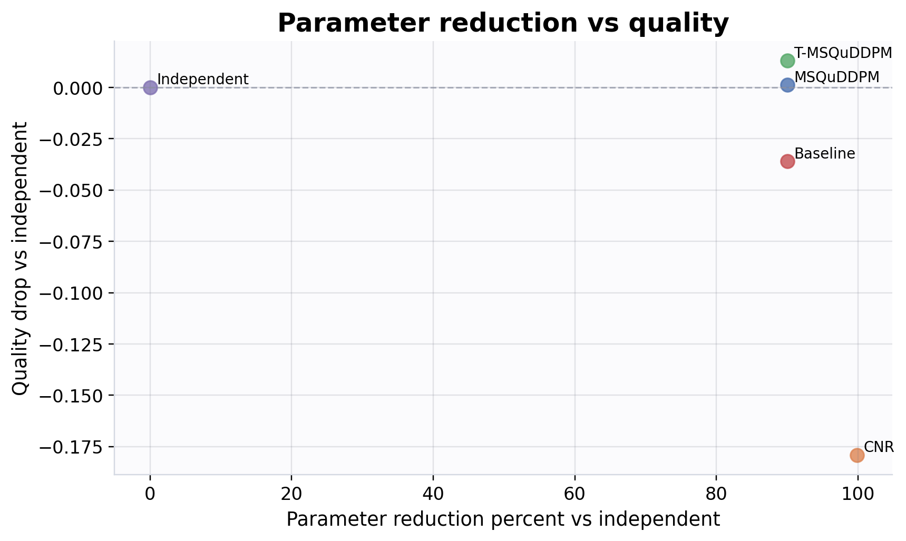

# QuDDPM-lite PyTorch Sandbox

이 프로젝트는 **QuDDPM/MSQuDDPM 아이디어를 바탕으로 한 본선 대비용 lightweight sandbox**입니다. 논문 완전 재현이나 하드웨어 수준 구현이 아니라, forward diffusion, denoising, prior-based generation evaluation, metric calculation, resource comparison을 팀 단위로 빠르게 실험하기 위한 PyTorch 기반 벤치마크입니다.

CUDA가 있으면 GPU를 사용하고, 없으면 CPU에서 실행됩니다.

## Abstract

이 프로젝트는 QuDDPM/MSQuDDPM 논문 완전 재현이 아니라, **QuDDPM/MSQuDDPM 아이디어를 바탕으로 한 본선 대비용 lightweight sandbox**입니다. 목표는 작은 qubit 수에서 forward corruption, denoising, prior-based generation evaluation, fairness logging, resource comparison을 빠르게 반복 검증하는 것입니다. 현재 README benchmark 기준으로는 `cnr`가 generation comparator로 가장 낮은 Wasserstein을 보였고, `msquddpm`/`t_msquddpm`는 `quddpm_baseline`보다 generation/resource trade-off에서 더 나은 위치를 보였습니다. 반면 reconstruction fidelity는 baseline이 더 높게 나온 조건도 있었으므로, 이 저장소는 “단일 승자”를 주장하는 코드가 아니라 comparator별 강점과 한계를 함께 드러내는 연구형 sandbox로 해석하는 것이 맞습니다.

## Project Scope

- 논문 전체 재현이 아닙니다.
- 본선 문제를 미리 정답 구현한 코드도 아닙니다.
- 목표는 작은 qubit 수와 가벼운 실험 설정에서 QuDDPM 계열 workflow를 반복 검증하는 것입니다.

Application note:

> 이 프로젝트는 본선 세부 문제의 정답을 미리 구현한 것이 아니라, Quantum DDPM 계열 문제에 필요한 forward diffusion, denoising, generation evaluation, metric calculation, resource comparison을 팀 단위로 사전 연습하기 위한 PyTorch 기반 sandbox입니다.

## What Was Added In This Version

- true `smoke` / `mini` preset
- prior-based generation evaluation
- `cnr` one-step comparator
- cumulative depolarizing schedule
- forward corruption logging
- extended resource metrics
- operational `match_corruption` calibration
- `independent_step_quddpm` baseline and parameter-efficiency artifacts
- `ancilla_toy` post-selection concept demo
- markdown report generator

## Models

| 모델 | 역할 |
|---|---|
| `msquddpm` | depolarizing forward를 되돌리는 기본 denoiser |
| `quddpm_baseline` | random-unitary forward를 쓰는 baseline denoiser |
| `t_msquddpm` | temporal sharing을 넣은 denoiser 변형 |
| `cnr` | latent classical noise에서 직접 상태를 생성하는 one-step comparator |
| `independent_step_quddpm` | step마다 별도 denoiser를 두는 naive upper-cost baseline |
| `ancilla_toy` | data+ancilla PQC와 post-selection을 보여주는 concept demo |

`cnr`는 QuDDPM 대체 모델이 아니라, **target-conditioned denoising 없이 latent classical noise만으로 ensemble을 생성하는 single-step comparator**입니다. post-selection 없이 resource-efficient한 비교군으로 두었습니다.

`ancilla_toy`는 full QuDDPM reproduction이 아니라, official reverse process의 핵심 아이디어인 data+ancilla PQC와 measurement/post-selection을 small-scale pure-state setting에서 보여주는 toy module입니다.

## Presets

| preset | 기본 목적 | 기본 설정 요약 |
|---|---|---|
| `smoke` | CPU/GPU 빠른 검증 | 2 qubits, 16 states, 1 epoch, `msquddpm` |
| `mini` | 짧은 기능 검증 | 4 qubits, 64 states, 10 epochs, `msquddpm/t_msquddpm/cnr` |
| `tenminute` | 짧은 단일-seed sanity benchmark | 6 qubits, 256 states, 60 epochs |
| `twohour_readme` | README/보고용 비교 번들 | 6 qubits, 512 states, 400 epochs, single condition, 3 seeds, baseline+shared+cnr+independent, `match_corruption` on |
| `twohour` | 기존 스타일 장시간 벤치마크 | 6 qubits, 512 states, 400 epochs |
| `research` | 기본 연구용 defaults | 6 qubits, 512 states, 1000 epochs |
| `full` | 더 큰 장기 실행 | 6 qubits, 1024 states, 3000 epochs |

## Reconstruction Vs Generation

- reconstruction:
  clean target state에서 noisy input을 만든 뒤, model이 clean state를 얼마나 복원하는지 평가합니다.
- generation:
  target input을 직접 주지 않고 prior에서 시작해 generated ensemble을 만들고, 그 ensemble이 target test ensemble과 얼마나 가까운지 평가합니다.

이 둘은 의도적으로 분리되어 있으며, `metrics.csv`에는 reconstruction metric과 generation metric이 각각 따로 저장됩니다.

주요 컬럼 예시는 다음과 같습니다.

- reconstruction:
  `reconstruction_fidelity`, `reconstruction_pure_state_fidelity`, `reconstruction_mmd`, `reconstruction_wasserstein`
- generation:
  `generation_mmd`, `generation_wasserstein`, `generation_nearest_fidelity_mean`, `generation_prior_mode`, `generation_sampling_mode`

호환성을 위해 기존 `fidelity`, `mmd`, `wasserstein` 컬럼도 유지합니다.

- denoiser 계열은 reconstruction 값을 넣습니다.
- `cnr`는 generation 지표를 넣습니다.

## Forward Processes

지원하는 forward corruption은 다음 두 계열입니다.

- `random_unitary`
  `quddpm_baseline`에 사용됩니다.
- `depolarizing`
  `msquddpm`, `t_msquddpm`, `independent_step_quddpm`에 사용됩니다.

depolarizing schedule은 두 모드를 지원합니다.

- `single_beta`
  `rho_t = (1 - beta_t) rho_0 + beta_t I / d`
- `cumulative`
  `rho_t = alpha_bar_t rho_0 + (1 - alpha_bar_t) I / d`

`noise_curve.csv`에는 다음 컬럼이 저장됩니다.

- `step`
- `beta`
- `alpha`
- `alpha_bar`
- `expected_fidelity_single_beta`
- `expected_fidelity_cumulative`

## Match Corruption

- random-unitary baseline과 depolarizing forward는 corruption severity가 자동으로 같아지지 않습니다.
- 그래서 `--match-corruption` 옵션은 final target-noisy fidelity를 기준으로 depolarizing schedule을 operational하게 맞춥니다.
- 이 기능의 목적은 “우리 모델이 더 좋다”가 아니라, **공정 비교를 위해 noise 강도를 통제하는 것**입니다.
- 이는 완벽한 물리적 동등성 보장이 아니라, finite benchmark에서의 operational fairness calibration입니다.

## Fairness And Limitations

- random-unitary forward와 depolarizing forward는 corruption strength가 자동으로 같아지지 않습니다.
- 그래서 각 run에 `forward_final_target_noisy_fidelity_mean`과 `forward_process_type`을 같이 기록합니다.
- `match_corruption`을 켜면 `target_corruption_fidelity`, `actual_forward_fidelity_mean`, `corruption_match_error_abs`도 같이 저장됩니다.
- generation evaluation은 prior-based이지만, 현재 reverse chain은 논문 수준의 exact Markov sampler가 아니라 lightweight surrogate입니다.
- `cnr`는 QuDDPM 대체가 아니라 comparator입니다.
- `ancilla_toy`는 pure-state toy setting 중심이며, full measurement-based QuDDPM 구현이 아닙니다.
- resource metrics는 실제 hardware transpilation count가 아니라 heuristic estimate입니다.

명시적으로, **estimated resource metrics are heuristic, not transpiled hardware counts** 입니다.

또한 depolarizing channel의 physical cost를 explicit unitary depth와 동일시하지 않기 위해, `channel_application_count`를 별도 컬럼으로 분리해 기록합니다.

## Resource Metrics

`metrics.csv`에는 기존 parameter/depth 추정 외에 다음 컬럼이 추가되었습니다.

- `denoiser_depth_per_step`
- `denoiser_two_qubit_gates_per_step`
- `denoiser_single_qubit_rotations_per_step`
- `total_reverse_depth`
- `total_reverse_two_qubit_gate_count`
- `total_reverse_single_qubit_rotation_count`
- `forward_unitary_depth`
- `forward_two_qubit_gate_count`
- `channel_application_count`
- `total_estimated_depth`
- `total_estimated_two_qubit_gate_count`
- `generation_call_count`
- `resource_notes`

요약 집계는 `summary_table.csv`에 들어가며, generation quality와 total resource 평균도 함께 저장됩니다.

## Parameter Efficiency

- Temporal parameter sharing은 실행 회로 depth를 직접 줄이는 것이 아니라, 주로 trainable parameter count와 optimizer burden을 줄이는 설계입니다.
- 그래서 `t_msquddpm`은 `independent_step_quddpm`과 같이 봐야 의미가 드러납니다.
- 이 프로젝트에서는 `independent_step_quddpm`을 naive upper-cost baseline으로 두고, `t_msquddpm`과 parameter/quality trade-off를 비교합니다.
- 해당 비교 역시 lightweight benchmark 기준이며, 논문 전체 재현 결과가 아닙니다.

## README Benchmark Snapshot

아래 그림은 `twohour_readme` preset을 실제로 실행한 결과입니다.

- command:
  `python main.py --preset twohour_readme --results-dir results_readme_twohour`
- artifacts:
  [report.md](results_readme_twohour/report.md), [summary_table.csv](results_readme_twohour/summary_table.csv), [parameter_efficiency_table.csv](results_readme_twohour/parameter_efficiency_table.csv)

### 1. Generation Quality



- `cnr`는 generation-only one-step comparator로서 가장 낮은 generation Wasserstein (`0.6421`)을 기록했습니다.
- `msquddpm`와 `t_msquddpm`는 `quddpm_baseline`보다 더 낮은 generation Wasserstein (`0.8145`, `0.8096` vs `0.8649`)을 기록했습니다.
- `independent_step_quddpm`는 shared 계열보다 generation metric이 약간 불리했고 (`0.8213`), 아래 parameter figure와 같이 비용은 훨씬 큽니다.

### 2. Resource Tradeoff



- `quddpm_baseline`은 reconstruction 쪽 평균은 가장 높았지만, total estimated depth가 `680`으로 가장 큽니다.
- `msquddpm`, `t_msquddpm`, `independent_step_quddpm`는 depth `340` 구간에 모이지만 generation quality는 shared 계열이 더 유리합니다.
- `cnr`는 depth `34` 수준의 one-step comparator라서, reverse diffusion 계열과는 다른 비용/품질 위치에 있습니다.

### 3. Parameter Efficiency



- `independent_step_quddpm`는 step별 독립 denoiser 때문에 약 `8,012,960` trainable parameters를 가집니다.
- `msquddpm`는 약 `801,800`, `t_msquddpm`는 약 `801,264` parameters로, independent baseline 대비 약 `90%` parameter reduction을 보입니다.
- 이 비교는 temporal parameter sharing이 “품질을 조금 희생하더라도 optimizer burden과 parameter growth를 크게 줄이는 설계”라는 점을 보여줍니다.

### 4. Parameter Reduction Vs Quality



- `msquddpm`와 `t_msquddpm`는 independent baseline 대비 약 `90%` parameter reduction을 유지하면서 quality drop을 크게 키우지 않았습니다.
- 이 run에서는 `t_msquddpm`가 generation metric에서는 `msquddpm`보다 약간 더 좋았고, reconstruction fidelity는 약간 낮았습니다.
- 즉, 본 결과는 `T-MSQuDDPM-lite`가 “항상 우세”라기보다, shared parameterization으로 더 좋은 parameter/resource trade-off를 제공한다는 쪽에 가깝습니다.

요약:

- generation comparator로는 `cnr`가 가장 강했습니다.
- shared QuDDPM 계열(`msquddpm`, `t_msquddpm`)은 baseline보다 generation/resource 쪽에서 더 좋은 위치를 보였습니다.
- baseline은 reconstruction fidelity에서 강점을 보였지만, 비용이 컸습니다.
- `match_corruption`은 physical equivalence가 아니라 operational fairness calibration이며, 이 결과도 그 전제 아래 해석해야 합니다.

## Discussion

- 이 결과는 reconstruction benchmark와 generation benchmark를 분리해서 봐야 의미가 있습니다. `quddpm_baseline`은 reconstruction fidelity에서 가장 강했지만, generation Wasserstein과 total estimated depth에서는 불리했습니다.
- `msquddpm`와 `t_msquddpm`는 baseline 대비 generation metric과 resource metric에서 더 좋은 위치를 보였습니다. 특히 `t_msquddpm`는 `msquddpm`보다 generation 쪽이 약간 더 좋고 parameter 수는 거의 같은 수준이라, temporal sharing의 실용적 의미를 보여줍니다.
- `independent_step_quddpm`는 shared 계열보다 약 `10x` 큰 파라미터 수와 매우 긴 runtime을 보여줬습니다. 이 baseline은 품질 우월성을 보여주기보다, step-wise 독립 파라미터화가 실제로 얼마나 비싼지 보여주는 reference로 보는 편이 맞습니다.
- `cnr`는 generation-only one-step comparator로서는 매우 강하게 나왔지만, QuDDPM 대체 모델로 읽으면 안 됩니다. reconstruction과 reverse diffusion 구조를 직접 비교하는 대상이 아니라, lightweight comparator입니다.
- `match_corruption`은 random-unitary와 depolarizing forward를 물리적으로 동일하게 만드는 기능이 아니라, finite benchmark에서 final target-noisy fidelity를 맞추는 operational fairness calibration입니다.

## Conclusion

이 저장소는 본선 문제의 정답 구현이 아니라, QuDDPM 계열 아이디어를 실험 설계 관점에서 준비하기 위한 benchmark sandbox로서는 충분히 의미 있는 상태입니다. 현재 결과만 보면 `cnr`는 generation comparator로 강하고, shared QuDDPM 계열은 baseline 대비 generation/resource trade-off에서 유리하며, `independent_step_quddpm`는 parameter-efficiency 비교를 위한 기준점 역할을 잘 수행합니다. 따라서 발표나 신청서에서는 “무조건 최고 성능”보다, 공정 비교, generation/reconstruction 분리, parameter efficiency, limitation 명시가 함께 들어간 준비된 연구형 sandbox라는 점을 전면에 두는 것이 가장 설득력 있습니다.

## Outputs

실행하면 결과 폴더에 보통 아래 파일들이 생성됩니다.

- `metrics.csv`
- `summary_table.csv`
- `seed_summary.csv`
- `loss_history.csv`
- `noise_curve.csv`
- `fidelity_comparison.png`
- `mmd_wasserstein_comparison.png`
- `resource_tradeoff.png`
- `fidelity_vs_noise.png`
- `generation_quality_comparison.png`
- `total_resource_tradeoff.png`
- `parameter_efficiency_table.csv`
- `parameter_efficiency.png`
- `quality_vs_params.png`
- `parameter_reduction_vs_quality.png`
- 모델별 `loss_curve_*.png`

## Recommended Commands

smoke:

```bash
python main.py --preset smoke --results-dir results_smoke
python verify_results.py --results-dir results_smoke
```

mini with CNR:

```bash
python main.py --preset mini --models msquddpm t_msquddpm cnr --results-dir results_mini
python verify_results.py --results-dir results_mini
```

twohour original benchmark:

```bash
python main.py --preset twohour --results-dir results_twohour_new
python verify_results.py --results-dir results_twohour_new
```

twohour README bundle:

```bash
python main.py --preset twohour_readme --results-dir results_readme_twohour
python verify_results.py --results-dir results_readme_twohour
python -m quddpm_lite.report --results-dir results_readme_twohour --out results_readme_twohour/report.md
```

tenminute sanity benchmark:

```bash
python main.py --preset tenminute --results-dir results_tenminute
python verify_results.py --results-dir results_tenminute
```

baseline-only smoke:

```bash
python main.py --preset smoke --models quddpm_baseline --results-dir results_smoke_baseline
python verify_results.py --results-dir results_smoke_baseline
```

match corruption smoke:

```bash
python main.py --preset smoke --models quddpm_baseline msquddpm --match-corruption --results-dir results_match_smoke
python verify_results.py --results-dir results_match_smoke
```

parameter efficiency mini:

```bash
python main.py --preset mini --models independent_step_quddpm t_msquddpm msquddpm --results-dir results_param_eff
python verify_results.py --results-dir results_param_eff
```

ancilla toy smoke:

```bash
python main.py --preset smoke --models ancilla_toy --results-dir results_ancilla_smoke
python verify_results.py --results-dir results_ancilla_smoke
```

report generation:

```bash
python -m quddpm_lite.report --results-dir results_mini --out results_mini/report.md
```

## CLI Notes

자주 쓰는 옵션은 아래와 같습니다.

- `--models quddpm_baseline msquddpm t_msquddpm cnr independent_step_quddpm ancilla_toy`
- `--dataset-kind cluster1q`
- `--depolarizing-mode cumulative`
- `--prior-mode random_pure|maximally_mixed_jitter|depolarized_random`
- `--generation-sampling-mode one_step|iterative`
- `--match-corruption`

## Code Layout

```text
.
├── main.py
├── verify_results.py
├── src/quddpm_lite/
│   ├── cli.py
│   ├── config.py
│   ├── datasets.py
│   ├── experiments.py
│   ├── metrics.py
│   ├── models.py
│   ├── ancilla.py
│   ├── noise.py
│   ├── random_unitary.py
│   ├── report.py
│   ├── train.py
│   ├── utils.py
│   ├── verify.py
│   └── visualize.py
└── results_twohour/
```

## Setup

```bash
python3 -m venv .venv --system-site-packages
. .venv/bin/activate
python -m pip install -r requirements.txt
```
