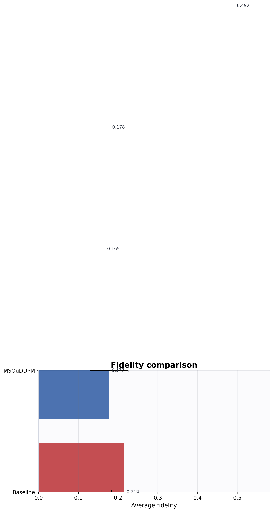
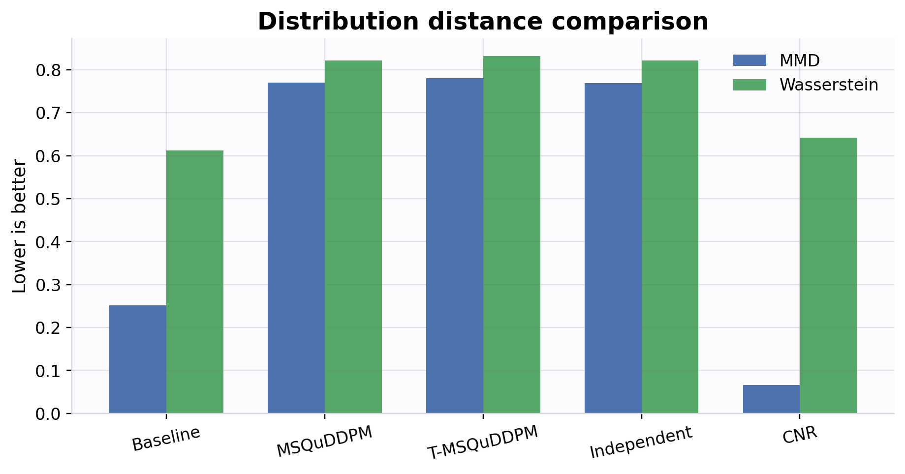
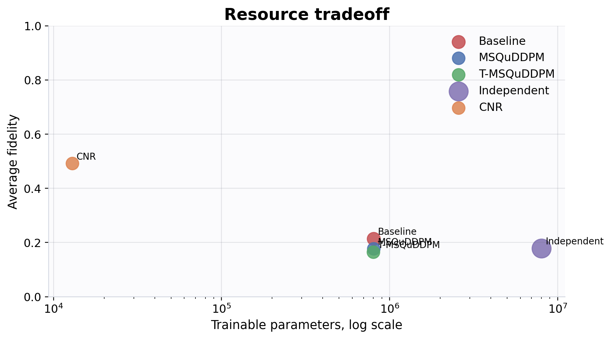
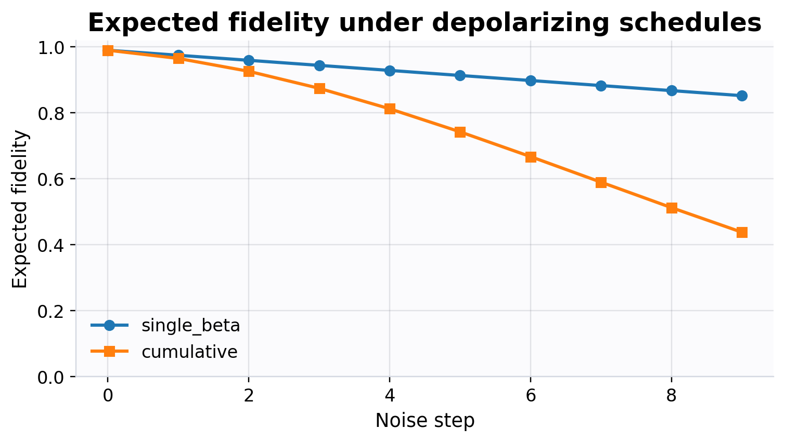

# Project Report

## Project Scope
이 프로젝트는 QuDDPM/MSQuDDPM 논문 완전 재현이 아니라, **QuDDPM/MSQuDDPM 아이디어를 바탕으로 한 본선 대비용 lightweight sandbox**입니다.

## Run Configuration
| Field | Value |
|---|---|
| qubits | 6 |
| dataset_size | 512 |
| models | quddpm_baseline msquddpm t_msquddpm cnr independent_step_quddpm |
| noise_steps_grid | [10] |
| depth_grid | [2] |
| epochs | 400 |
| prior_mode | depolarized_random |
| generation_sampling_mode | one_step |
| depolarizing_mode | single_beta |
| match_corruption | True |

## Models Compared
| Model | Role |
|---|---|
| quddpm_baseline | baseline denoiser with random-unitary forward |
| msquddpm | proposed depolarizing denoiser |
| t_msquddpm | temporal-sharing denoiser |
| cnr | one-step generation comparator |
| independent_step_quddpm | naive step-wise independent denoiser baseline |

## Reconstruction vs Generation
- reconstruction은 clean state에서 noisy input을 만든 뒤 복원 성능을 봅니다.
- generation은 target input 없이 prior에서 ensemble을 생성하고 test ensemble과 비교합니다.
- `cnr`는 QuDDPM 대체가 아니라 generation-only one-step comparator입니다.

## Fairness Checks
| Model | Forward | Forward Fidelity | Target Corruption Fidelity | Actual Forward Fidelity | Match Error |
|---|---|---|---|---|---|
| cnr | cnr_none | not available | not available | not available | not available |
| independent_step_quddpm | depolarizing_single_beta | 0.0172 | 0.0171 | 0.0172 | 0.0001 |
| msquddpm | depolarizing_single_beta | 0.0172 | 0.0171 | 0.0172 | 0.0001 |
| quddpm_baseline | random_unitary | 0.0171 | 0.0171 | 0.0171 | 0.0000 |
| t_msquddpm | depolarizing_single_beta | 0.0172 | 0.0171 | 0.0172 | 0.0001 |
match_corruption은 physical equivalence가 아니라, finite benchmark에서 random-unitary와 depolarizing forward의 severity를 operational fidelity 기준으로 맞추는 calibration입니다.

## Resource Analysis
| Model | Trainable Params | Total Estimated Depth | Total Reverse Depth | Total Estimated 2Q Gates | Channel Applications |
|---|---|---|---|---|---|
| cnr | 12912.0000 | 34.0000 | 0.0000 | 10.0000 | 0.0000 |
| independent_step_quddpm | 8012960.0000 | 340.0000 | 340.0000 | 100.0000 | 10.0000 |
| msquddpm | 801800.0000 | 340.0000 | 340.0000 | 100.0000 | 10.0000 |
| quddpm_baseline | 801800.0000 | 680.0000 | 340.0000 | 200.0000 | 0.0000 |
| t_msquddpm | 801264.0000 | 340.0000 | 340.0000 | 100.0000 | 10.0000 |

## Parameter Efficiency
| Condition | Model | Trainable Params | Param Ratio vs Independent | Param Reduction % | Quality Drop |
|---|---|---|---|---|---|
| q6_T10_d2_h96 | cnr | 12912.0000 | 0.0016 | 99.8389 | -0.1792 |
| q6_T10_d2_h96 | independent_step_quddpm | 8012960.0000 | 1.0000 | 0.0000 | 0.0000 |
| q6_T10_d2_h96 | msquddpm | 801800.0000 | 0.1001 | 89.9937 | 0.0012 |
| q6_T10_d2_h96 | quddpm_baseline | 801800.0000 | 0.1001 | 89.9937 | -0.0360 |
| q6_T10_d2_h96 | t_msquddpm | 801264.0000 | 0.1000 | 90.0004 | 0.0130 |

## Ancilla / Post-selection
ancilla_toy not run in this result directory.

## Key Findings
- `quddpm_baseline` achieved the highest mean reconstruction fidelity under this result directory (0.2144).
- `cnr` achieved the lowest mean generation Wasserstein in this lightweight setting (0.6421).
- `cnr` is reported as a one-step generation comparator, not as a QuDDPM replacement.
- Forward corruption severity is logged to avoid unfair comparisons between random-unitary and depolarizing forwards.

## Limitations
- full paper reproduction 아님
- resource metrics are heuristic, not hardware-transpiled counts
- small-scale benchmark
- match_corruption은 operational fidelity matching이지 physical equivalence가 아님
- ancilla_toy는 conceptual module일 뿐 full measurement-based QuDDPM 아님

## Application Note
본 프로젝트는 본선 세부 문제의 정답을 미리 구현한 것이 아니라, Quantum DDPM 계열 문제에 필요한 forward diffusion, denoising, generation evaluation, metric calculation, resource comparison을 팀 단위로 사전 연습하기 위한 PyTorch 기반 sandbox입니다.
현재 결과 디렉터리는 qubits=6, dataset_size=512, noise_steps=[10], depth=[2] 조건을 중심으로 생성됐습니다.
reconstruction metric과 generation metric을 분리해 기록함으로써 denoising benchmark와 generative benchmark를 혼동하지 않도록 했습니다.
CNR comparator, independent-step baseline, ancilla toy module을 통해 comparator, parameter efficiency, 공식 구조 정합성 측면을 각각 분리해 검토할 수 있게 했습니다.
공정 비교를 위해 forward corruption severity와 match_corruption calibration 결과를 함께 기록하며, 과장 없이 한계와 다음 개선 우선순위를 드러내는 연구형 sandbox를 지향합니다.

## Noise Curve
| step | beta | alpha | alpha_bar | expected_fidelity_single_beta | expected_fidelity_cumulative |
|---|---|---|---|---|---|
| 0.0000 | 0.0100 | 0.9900 | 0.9900 | 0.9902 | 0.9902 |
| 1.0000 | 0.0256 | 0.9744 | 0.9647 | 0.9748 | 0.9653 |
| 2.0000 | 0.0411 | 0.9589 | 0.9250 | 0.9595 | 0.9262 |
| 3.0000 | 0.0567 | 0.9433 | 0.8726 | 0.9442 | 0.8746 |
| 4.0000 | 0.0722 | 0.9278 | 0.8096 | 0.9289 | 0.8126 |
| 5.0000 | 0.0878 | 0.9122 | 0.7385 | 0.9136 | 0.7426 |
| 6.0000 | 0.1033 | 0.8967 | 0.6622 | 0.8983 | 0.6675 |
| 7.0000 | 0.1189 | 0.8811 | 0.5835 | 0.8830 | 0.5900 |

## Figures

